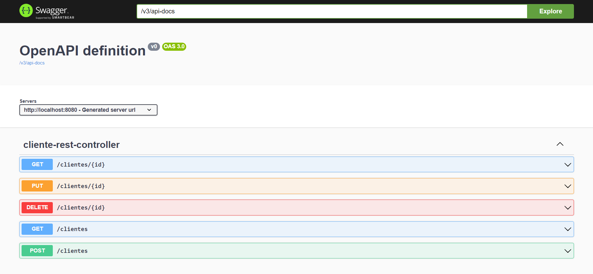

# 📋 API Rest - Digital Innovation One (DIO)
> Construção de uma API Rest com aplicação de Padrões de Projeto

## ✔️ Status do Projeto
> 🚧 Em construção...  🚧

## Routes

## 🛠️ Tecnologias Utilizadas

- spring initialzr
- spring-boot-starter-web
- spring-boot-starter-data-jpa
- springdoc-openapi-starter-webmvc-ui
- spring-cloud-starter-openfeign
- h2